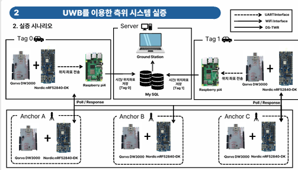
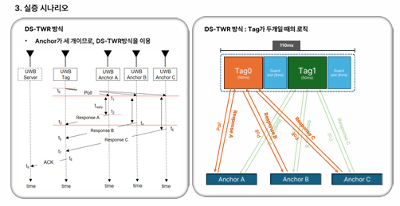

# 🚁 UAM 버티포트 정밀 감시 시스템 🚁

> 2025 전국 대학생 UAM 올림피아드 전파환경분석 부문 출품작  
> UWB DS-TWR 기반 버티포트 정밀 측위 및 감시 시스템

---

## 📌 1. 프로젝트 개요

UAM 버티포트의 안전한 운용을 위해 기존 공항 감시체계인 MLAT의 성능 기준을  
버티포트 환경에 맞게 재정의하고, UWB 기반 정밀 측위 시스템을 제안한 프로젝트입니다.

Qorvo DW3000과 Nordic nRF52840-DK 기반 UWB 모듈을 활용하여  
DS-TWR 방식의 위치 추적 시스템을 구성했으며, Monte Carlo 시뮬레이션과 실제 하드웨어 실증을 통해  
제안 기준의 타당성과 시스템 안정성을 검증했습니다.

### 🧩 핵심 기능

- 버티포트 환경에 맞춘 감시 성능 기준 재정의
- UWB DS-TWR 기반 Tag / Anchor 측위 시스템 구현
- Raspberry Pi 기반 위치 데이터 수집 및 DB 저장
- MySQL 기반 시간·좌표 데이터 관리
- Ground Station 기반 위치 추적 모니터링
- Monte Carlo 시뮬레이션을 통한 오경보율 검증

---

## 🔍 2. 핵심 문제 정의

기존 공항 지상 감시체계인 MLAT은 항공기 지상 이동 감시를 기준으로 설계되어  
95% 신뢰구간 7.5 m, 99% 신뢰구간 12 m 이내의 성능을 요구합니다.

그러나 UAM 기체는 일반 항공기보다 크기가 작고, 버티포트는 도심 주요 거점에 설치되므로  
기존 공항 기준을 그대로 적용할 경우 버티포트 환경에서는 오경보가 발생할 가능성이 높습니다.

이에 따라 본 프로젝트에서는 버티포트 Taxiway와 공항 Taxiway의 규격 차이를 반영하여  
감시 성능 기준을 Scale Down하는 방식을 제안했습니다.

| 구분 | 95% 신뢰구간 | 99% 신뢰구간 |
|---|---:|---:|
| 기존 MLAT 기준 | 7.5 m | 12 m |
| 제안 버티포트 기준 | 1.78 m | 2.85 m |

> 버티포트 Taxiway 규격 / 공항 Taxiway 규격 = **K = 0.238**  
> 기존 MLAT 기준에 Scale Factor를 적용하여 버티포트 환경에 적합한 정밀 감시 기준을 도출했습니다.

---

## 🖥️ 3. 시스템 구성

| 구성 요소 | 역할 |
|---|---|
| Qorvo DW3000 | UWB 기반 거리 측정 모듈 |
| Nordic nRF52840-DK | UWB Tag / Anchor 제어 보드 |
| Raspberry Pi 4 | 위치 데이터 수집 및 MySQL DB 저장 |
| MySQL | 시간·위치 좌표 데이터 실시간 저장 |
| Ground Station PC | 위치 추적 및 모니터링 |

### 실증 구성

| 구분 | 구성 |
|---|---|
| Tag | 2개 |
| Anchor | 3개 |
| 측위 방식 | DS-TWR |
| 데이터 저장 | Raspberry Pi 4 + MySQL |
| 모니터링 | Ground Station PC |

---

## 📐 4. 측위 방식

본 프로젝트에서는 UWB 기반 측위 방식 중 **DS-TWR(Double-Sided Two-Way Ranging)** 방식을 채택했습니다.

DS-TWR은 Tag와 Anchor가 양방향으로 신호를 주고받으며 거리를 계산하는 방식으로,  
TDoA 방식과 달리 앵커 간 정밀 시간 동기화가 필요하지 않습니다.

초기 버티포트 운영 환경에서는 동시에 관제해야 하는 eVTOL 수가 제한적이므로,  
확장성보다 개별 기체에 대한 높은 거리 측정 정확도와 시스템 안정성이 더 중요하다고 판단했습니다.

| 구분 | UWB TWR | UWB TDoA |
|---|---|---|
| 앵커 간 동기화 | 불필요 | 필수 |
| 시스템 복잡도 | 낮음 | 높음 |
| 확장성 | 낮음 | 높음 |
| 개별 거리 측정 정확도 | 높음 | 보통 |
| 초기 버티포트 적용성 | 높음 | 조건부 적합 |

---

## 📊 5. 검증 결과

Monte Carlo 시뮬레이션을 100,000회 수행하여  
기존 MLAT 기준과 제안 버티포트 기준의 오경보율을 비교했습니다.

| 조건 | σ | 오경보율 |
|---|---:|---:|
| 기존 MLAT 기준, 95% → 7.5 m | 3.064 | 8.1192% |
| 제안 버티포트 기준, 95% → 1.78 m | 0.729 | 0.0000% |
| 기존 MLAT 기준, 99% → 12 m | 3.954 | 12.6362% |
| 제안 버티포트 기준, 99% → 2.85 m | 0.941 | 0.0015% |

### 분석 결과

- 기존 MLAT 기준을 버티포트에 그대로 적용할 경우 높은 오경보율 발생
- 버티포트 규격을 반영한 제안 기준 적용 시 오경보율 대폭 감소
- UWB DS-TWR 기반 실증 환경에서 안정적인 위치 추적 가능성 확인
- 초기 UAM 버티포트 감시 시스템에 적합한 정밀 측위 구조 검증

---

## 🧪 6. 실증 결과

제안한 UWB DS-TWR 기반 정밀 감시 시스템을 실제 하드웨어 환경에서 구현하고,  
Tag와 Anchor 간 거리 측정 및 위치 추적 데이터를 수집했습니다.

실증 결과, 제안된 위치 추적 시스템은 버티포트 환경에서 요구되는 정밀도 기준을 만족했으며,  
오경보 없이 안정적인 UAM 기체 추적이 가능함을 확인했습니다.

---

## ⚙️ 7. 기술 스택

  
  
  
  
  
  

---

## 🛠️ 8. 주요 기술

| 기술 | 적용 내용 |
|---|---|
| UWB DS-TWR | Tag와 Anchor 간 양방향 거리 측정 |
| Qorvo DW3000 | UWB 송수신 기반 정밀 거리 측정 |
| Nordic nRF52840-DK | Tag / Anchor 제어 및 데이터 처리 |
| Raspberry Pi 4 | 측위 데이터 수집 및 DB 연동 |
| MySQL | 시간·좌표 기반 측위 데이터 저장 |
| Python | Monte Carlo 시뮬레이션 및 결과 분석 |
| Ground Station | 버티포트 내 위치 추적 모니터링 |

---

## 🏆 9. 성과

- 2025 전국 대학생 UAM 올림피아드 전파환경분석 부문 베스트혁신상 수상
- 버티포트 환경에 적합한 정밀 감시 성능 기준 제안
- UWB DS-TWR 기반 Tag / Anchor 측위 시스템 구현
- Monte Carlo 시뮬레이션 100,000회를 통한 오경보율 검증
- 실제 하드웨어 기반 위치 추적 실증 수행
