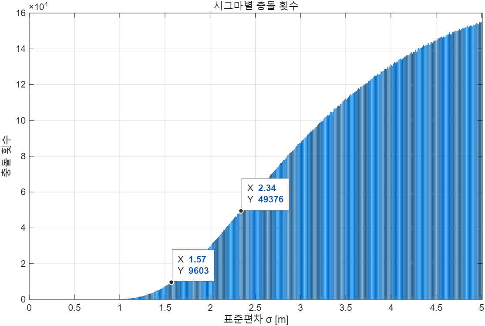
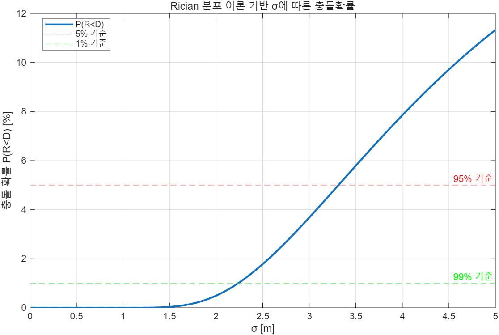

# 📊 UAM Vertiport Surveillance Simulation

> UAM 버티포트 정밀 감시 시스템의 위치 오차 허용 기준을 검토하기 위한
> Monte Carlo 및 이론 기반 충돌확률 분석 시뮬레이션

---

## 📌 1. 프로젝트 개요

본 프로젝트는 UAM 버티포트 환경에서 eVTOL 기체 간 위치 오차가 충돌 가능성에 미치는 영향을 분석하기 위한 시뮬레이션 코드입니다.

버티포트 내 기체 간 평균 중심 간 거리를 기준으로 설정하고, 각 기체의 위치 오차가 정규분포를 따른다고 가정했습니다. 이후 Monte Carlo 시뮬레이션을 통해 위치 오차 표준편차 `σ` 변화에 따른 충돌 발생률을 계산하고, 이론 기반 확률 모델과 비교했습니다.

본 시뮬레이션은 UWB DS-TWR 기반 정밀 감시 시스템에서 요구되는 위치 정확도 기준을 검토하기 위한 사전 검증 목적으로 수행되었습니다.

---

## 🔍 2. 문제 정의

UAM 버티포트는 기존 공항보다 협소한 공간에서 eVTOL의 이착륙, 이동, 대기 과정이 이루어집니다. 따라서 위치 추적 시스템의 오차가 커질 경우, 실제 기체 위치와 관측 위치 사이의 차이로 인해 충돌 위험 또는 오경보가 발생할 수 있습니다.

본 시뮬레이션에서는 다음 질문을 검토했습니다.

> 위치 오차가 어느 정도까지 커질 때,
> eVTOL 간 충돌 가능성이 허용 가능한 수준을 넘어서는가?

이를 위해 위치 오차의 표준편차 `σ`를 변화시키며 충돌 확률을 계산했습니다.

---

## 🧪 3. 시뮬레이션 가정

| 항목                | 설정                         |
| ----------------- | -------------------------- |
| eVTOL 기준 길이 `D`   | 10 m                       |
| 평균 중심 간 거리        | `1.5D = 15 m`              |
| 충돌 판정 기준          | 실제 중심 간 거리 `< D`           |
| 위치 오차 모델          | Gaussian Noise, `N(0, σ²)` |
| σ 탐색 범위           | 0.01 m ~ 5.0 m             |
| σ 증가 간격           | 0.01 m                     |
| Monte Carlo 반복 횟수 | 1,000,000회                 |
| 분석 대상             | 두 eVTOL 간 중심 거리 변화         |

---

## 📐 4. 충돌 판정 모델

두 eVTOL의 이상적인 중심 간 거리를 `1.5D`로 설정한 뒤, 각 기체의 x, y 위치에 독립적인 정규분포 기반 위치 오차를 적용했습니다.

```text
eVTOL 1 위치: (x1, y1)
eVTOL 2 위치: (x2, y2)

distance = sqrt((x1 - x2)^2 + (y1 - y2)^2)
```

계산된 실제 중심 간 거리 `distance`가 eVTOL 기준 길이 `D`보다 작아지는 경우를 충돌로 판정했습니다.

```text
if distance < D:
    collision = True
```

---

## 🔄 5. Monte Carlo Simulation

Monte Carlo 시뮬레이션에서는 위치 오차 표준편차 `σ`를 0.01 m부터 5.0 m까지 변화시키며, 각 σ 값에 대해 1,000,000회의 무작위 위치 오차를 생성했습니다.

각 반복에서 두 기체의 실제 중심 간 거리를 계산하고, 충돌 조건을 만족하는 횟수를 누적하여 충돌률을 도출했습니다.

```text
σ 증가
  ↓
무작위 위치 오차 생성
  ↓
두 기체의 실제 중심 간 거리 계산
  ↓
충돌 여부 판정
  ↓
충돌률 계산
```

---

## 📊 6. Monte Carlo 결과

Monte Carlo 시뮬레이션 결과, 위치 오차 표준편차 `σ`가 증가할수록 충돌 횟수와 충돌률이 증가하는 경향을 확인했습니다.

| 기준           |         결과 |
| ------------ | ---------: |
| 충돌률 5% 이하 기준 | σ ≤ 2.34 m |
| 충돌률 1% 이하 기준 | σ ≤ 1.57 m |

```text
95% 기준: σ ≤ 2.34 m
99% 기준: σ ≤ 1.57 m
```

위 결과는 위치 오차가 특정 수준 이상으로 증가할 경우, 버티포트 내 기체 간 안전거리 확보가 어려워질 수 있음을 보여줍니다.



---

## 📈 7. 이론 기반 분석

Monte Carlo 결과와 비교하기 위해 이론 기반 충돌확률 분석도 수행했습니다.

두 기체의 x, y 위치 오차가 독립적인 정규분포를 따른다고 가정하면, 두 기체 간 중심 거리 분포는 Rician 분포로 근사할 수 있습니다.

이를 바탕으로 표준편차 `σ` 변화에 따른 충돌확률 `P(R < D)`를 계산했습니다.

```text
P(R < D)
```

여기서 `R`은 위치 오차가 반영된 두 기체 간 실제 중심 거리이며, `D`는 충돌 판정 기준 거리입니다.

---

## 📐 8. Rician 기반 충돌확률 계산

이론 기반 분석에서는 Rician CDF를 이용해 특정 `σ`에서의 충돌확률을 계산했습니다.

| 기준         |    이론 기반 결과 |
| ---------- | ----------: |
| 충돌확률 5% 기준 | σ ≈ 3.314 m |
| 충돌확률 1% 기준 | σ ≈ 2.237 m |

```text
95% 기준: σ ≈ 3.314 m
99% 기준: σ ≈ 2.237 m
```

Monte Carlo 결과와 이론 기반 결과는 절대값에서는 차이가 있으나, `σ`가 증가할수록 충돌확률이 증가한다는 동일한 경향을 보였습니다.



---

## 🛠️ 9. 코드 구성

| File        | Description                  |
| ----------- | ---------------------------- |
| `try1.m`    | Monte Carlo 기반 eVTOL 충돌확률 계산 |
| `theory1.m` | Rician 분포 기반 이론 충돌확률 계산      |


---

## 🧩 10. 활용

본 시뮬레이션 결과는 UAM 버티포트 정밀 감시 시스템 프로젝트에서
UWB DS-TWR 기반 위치 추적 시스템의 성능 기준을 검토하기 위한 근거 자료로 활용되었습니다.

* 위치 오차 허용 범위 검토
* eVTOL 간 충돌 가능성 분석
* 버티포트 감시 시스템의 정밀도 기준 수립
* Monte Carlo 및 이론 기반 성능 검증
